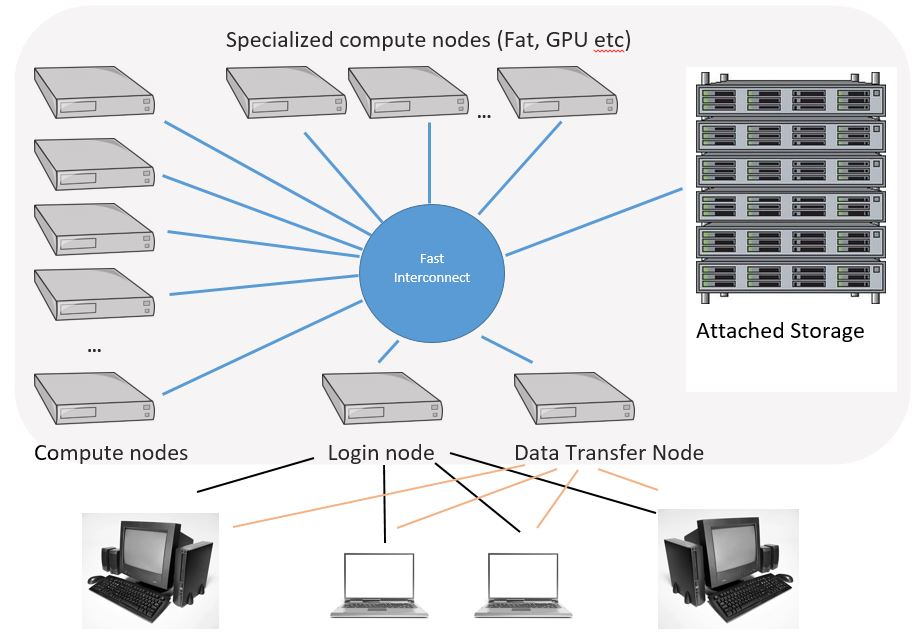
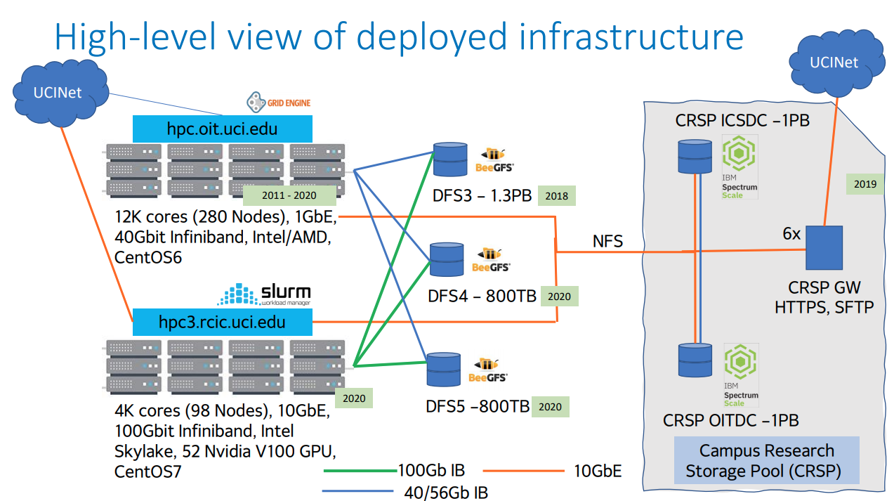
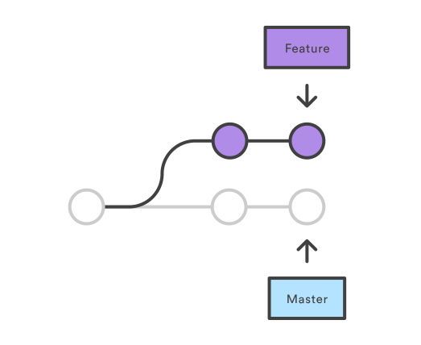

% Computational Lab Skills for Cognitive Science
% Joachim Vandekerckhove

---

## High performance computing

---

---

---

### Unix

---

Shell commands

* ls
* touch, rm
* mkdir, cd, rmdir
* cp, mv
* alias
* ln
* history
* man, whatis

---

Shell commands: Accessing remote computers

* wget
* ssh
* scp
* sshfs
* screen

---

Basic scripting

* cat, more, less
* head, tail
* nano
* hashbang #!
* dotslash ./
* Bash variables, $0, $1 ...
* grep, sed
* \|, >, \>\>, <, <<, &&, and \\

---

Permissions and keys

* rwxrwxrwxd, dotfiles
* sudo
* public key _id_rsa.pub_ (=lock)
* private key _id_rsa_ (=key)

[Linux-fu](https://linuxjourney.com/)

---

Version control

* Allow tracking of changes
* Allow branching and merging
* Highly secure

---

---

git

* Lots of functionality
* High performace
* Industry standard
* Not too hard to get started
* Quite hard to master

---

git commands

* git clone
* git status
* git checkout
* git diff
* git add
* git commit
* git push
* git fetch
* git -C my/dir

---

git habits

* commit often
* always update to latest versions
* use branches
* comment a lot
* test changes before committing

---

Example workflow

1. `git clone git@github.com:user/repo.git`
1. `git -C repo/ checkout -b small-edits`
1. _(make new file)_
1. `git -C repo/ add .`
1. _(make small edit)_
1. `git -C repo/ commit -a -m "Small change"`
1. _(make small edit)_
1. `git -C repo/ commit -a -m "Tiny change"`
1. `git push`
1. _(open pull request)_

---

Example workflow

1. `git checkout main`
1. `git fetch --all --prune`
1. `git rebase`
1. `git -C repo/ checkout -b bugfix`
1. _(make small edit)_
1. `git -C repo/ commit -a -m "Fixed bug"`
1. `git push`
1. _(open pull request)_

---

[Git tutorial](https://www.atlassian.com/git/tutorials/)

[Git cheat sheet](https://www.atlassian.com/dam/jcr:e7e22f25-bba2-4ef1-a197-53f46b6df4a5/SWTM-2088_Atlassian-Git-Cheatsheet.pdf)

---

Markdown

---

 \<your-pseudonym\>

---

## Learning goals

You will need to use these technologies to do and submit the assignments

---

## Assignment

Write and run a shell script

---

 \<your-pseudonym\>.sh

1. + First clones the class git repository and makes a new branch
1. + Then makes a new directory /assignment/\<your-pseudonym\>/ in the git repository
1. + Makes a copy of itself in the new directory
1. + Pushes the updates to the git repository
* Difficulty: your pseudonym appears in script only once
