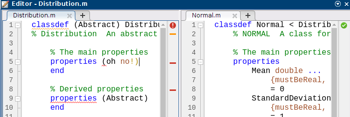

% Good coding practice, Part II: Attack of the Classes
% Joachim Vandekerckhove

## Literate programming

###

Literate programming is when programmers document their steps in a document that also executes the code.  This is a popular practice for publishing steps in a data analysis, and common examples are rmarkdown, jupyter, and MATLAB Live Scripts (.mlx).

Often these literate programs use some form of markdown for basic formatting of text.

### Basic markdown

Markdown is a language for doing very basic markup (get it???/).  The absolute basics of it are the use of # for headers (more #s for smaller headers), \* and \_ and \*\* for **_emphasis_**.  The basic philosophy is that you should be able to write a simple text file with simple formatting marks, that is still perfectly readable even if you're just looking at the unformatted code (as opposed to, say, LaTeX or html, which look weird in source code).

### Markdown editors

There are very many markdown editors out there.  I use one called [Typora](https://www.typora.io/).  There are also many tutorials, like [this one](https://daringfireball.net/projects/markdown/syntax).

To see what the markdown code looks like, open this file in a text editor like notepad or nano.  Here are some basic demonstrations...

### Block quotes

Make block quotes by starting a line with \>

> This is a block quote.  It makes it clear that a block of text belongs together and is somewhat separate from the main text.

### Code

Code can be typeset with three backticks \`\`\` :

```MATLAB
% This is a code block.
for he = a_jolly_good_fellow, disp('hoorah'), end
```
```r
# This is a code block with R style coloring.
trf <- typicalRfctn(x = x, y = y, setting_style = 'idk', 
  inp2 = function (.) { one = .}, optional = data$x)
```

You can also use single backticks \` to enclose in-line code examples `like this`.  Also, this looks nice in Slack.

### Tables

You can make tables by drawing them with lines!

```markdown
| Here | comes |    a | table |
| ---- | ----- | ---: | ----: |
| oh   | yes   |   it |   is! |
```

| Here | comes |    a | table |
| ---- | ----- | ---: | ----: |
| oh   | yes   |   it |   is! |

(The default html slide format doesn't do tables well.)

### Lists

It's easy

* to
* make
* lists

They can also

1. be
2. ordered
3. lists

### Links and images

Hyperlinks are added like `[this](https://cidlab.com)`, and figures almost identically with an exclamation mark and an empty text field: ``


### HTML

A powerful feature of markdown is that it can be extended by other markup languages if you need more complexity.  For example, you can just write html code if you want to, say, scale up an image:


### LaTeX

You can also insert LaTeX: $$0 = e^{\pi i} - 1$$

LaTeX often won't render in your editor, only if you compile.  In practice, you don't want to mix LaTeX and html elements since, depending on what you compile to, one or the other may not render correctly (or at all).

### ... compile?

There exist many viewers that natively render and display markdown (the github website is one).  However, it is generally easy to compile a .md file to a common format like .pdf, .htm, .doc, and so on.  The most powerful (I think) compiler is [pandoc](https://pandoc.org/).  

Using pandoc is fairly straightforward, usually you just tell it what you have (source `-s`) and what you want (output `-o`), and it does it.  For example:
```bash
pandoc \
	-s 210-good-coding-practice-part-ii.md \
	-o 210-good-coding-practice-part-ii.pdf
```

### make

As a side note, if you find yourself compiling something a lot, especially if it's a large project with many files, you should check out the **[make](https://makefiletutorial.com/)** utility.  make is a simple but clever program controlled by a (file called) Makefile.  There are several Makefiles in the course repo, looking a little like this:

```makefile
all: metropolis-hastings.pdf html/metropolis_intro.html

html/%.html: %.m
	matlab -batch "rng(0); publish('$<');"

%.pdf: %.tex
	pdflatex $<
```

###

Not unlike the pandoc command, Makefiles are structured in terms of what you _have_ (sources) and what you _want_ (targets).  The structure of each little section of a Makefile is the same:

```make
target: source
	rule_to_make_target_from_source
```

Inside a rule, the target is represented as `$@` and the source as `$<`.  If you have a Makefile in a directory, you can call `make` from the command line and optionally provide it with a target (by default it will do only the first target).  If a source is not available, make will look for a rule to build the source from other sources.

###

```makefile
all: metropolis-hastings.pdf html/metropolis_intro.html

html/%.html: %.m
	matlab -batch "rng(0); publish('$<');"

%.pdf: %.tex
	pdflatex $<
```

In the little example, the target `all` requires `metropolis-hastings.pdf`, and for this there exists the rule `%.pdf: %.tex` so it will look for `metropolis-hastings.tex` and use `pdflatex` to get `metropolis-hastings.pdf` and satisfy the `all` target.  

###

```make
target: source
	rule_to_make_target_from_source
```

Cleverly, make will also check that the source file is not _newer_ than the target file.  If it is newer, make will rebuild the target even if it exists.

Makefiles can get quite complex, but even easy ones can save you a lot of time!  Note that rules can be multiple lines, so you can do relatively complicated things like running entire simulation studies and pushing the results to github. 

### Styles

Compiling .md files can yield somewhat vanilla looking documents.  However, depending on what you are compiling _to_, you may be able to spruce things up a little.  For example, compiling `100-matlab-code-organization.md` to .htm slides didn't look nice, so I added a header file with style modifications.  In pandoc, you can add header information with `-H`, so that Makefile has this rule:

```makefile
%.htm: %.md styles
	pandoc -t dzslides -s $< -o $@ --slide-level 3 -H styles
```

### 

... and `styles` is just a file with CSS code:

```css
<style>
p {
  font-size: 25px;
  margin: 15px 50px;
}
code {
  color: #8728F1;
}
</style>
```

Pandoc has a lot of options to customize its output, and make can be used to automate it.  I make class slides and papers like this.

# More on classes

### Externally defined methods

When you implement a MATLAB class, you can either define it in a single `.m` file that starts with `classdef`, or you can create a folder that starts with `@` that also contains a classdef m-file of the same name.  You can then define many ([but not all](https://www.mathworks.com/help/matlab/matlab_oop/methods-in-separate-files.html#buq1cgq-1)) methods as functions in files in that folder.

Implementing classes as @-folders has a number of advantages, including avoidance of long code, and the ability to include files other than m-files in the class (e.g., p-files, MEX files, .mlx files).  The only disadvantage I can think of is for programmers who, for reasons that are their own, share code files through email and want to avoid zip archives and the like.

###

To [define a method externally](https://www.mathworks.com/help/matlab/matlab_oop/methods-in-separate-files.html), simply write it as a function and save it in the @-folder.  MATLAB will recognize it as a method of the class, with no attributes.

In order to define attributes for a method (like `Static` or `Access = private`), you must register the method in the classdef file.  Even if you do not need to define attributes, it seems good practice to register the method anyway.  Registering it is simple: create a `methods-end` block and place the _function signature_ ("stub definition") in the block, like so:

```MATLAB
classdef MyClass
   methods (Access = private)
      output = myFunc(obj,arg1,arg2)
   end
end
```

###

This is especially important for static methods, since MATLAB treats static and ordinary methods differently -- static methods are not passed the object when they are called, so incorrectly registering a method (or neglecting to register it) will result in "Too many input arguments" errors. 

Unless, of course, you wrote your function defensively, in which case it may just do a wrong thing and give you no clues.

### Class hierarchy and inheritance

Classes can exist in a hierarchy of subclasses and superclasses.  Each class can have zeros, one, or more sub- and superclasses.

The relationship is defined in the `classdef` statement:

```MATLAB
classdef Normal < Distribution
% NORMAL  A class for the normal distribution
...
end
```
### 

The superclass `Distribution` can provide universally applicable methods to all its subclasses:

```matlab
classdef (Abstract) Distribution
% Distribution  An abstract class for distributions
...
    % Ordinary methods apply to objects of the subclass
    methods
        function yax = deviance(obj, data)
            yax = -2 * sum(obj.logPdf(data));
        end
        function yax = pdf(obj, data)
            yax = exp(obj.logPdf(data));
        end
        function knl = pdfKernel(obj, xax)     
            knl = exp(obj.logPdfKernel(xax));
        end
```
###
```matlab
        function x = rnd(obj, dims)
            x = obj.inverseCdf(rand(dims));            
        end
        
        function disp(obj, propertyList)
            fprintf('%s distribution with parameters:\n', ...
                obj.Name);
            for p = 1:numel(propertyList)
                fprintf('     +  %-20s=%8.4f\n', ...
                    propertyList{p}, ...
                    obj.(propertyList{p}))             
            end
            fprintf('\n');
        end
    end
```
###
```matlab

    % Abstract methods *must* be implemented by children of the class
    methods (Abstract)
        cdf(obj, xValue)
        logPdf(obj, xValue)
        logPdfKernel(obj, xValue)
    end
end
```

Subclasses can then omit the methods, override them, or [call them directly](https://www.mathworks.com/help/matlab/matlab_oop/calling-superclass-methods-on-subclass-objects.html)

```matlab
classdef Normal < Distribution
...
    methods

        % % Probability density function
        % function yax = pdf(obj, xax)
        % % Implicitly defined by Distribution
        % end

        % % Probability density kernel
        % function knl = pdfKernel(obj, xax)
        % % Implicitly defined by Distribution
        % end

        % % Deviance score function
        % function yax = deviance(obj, data)
        % % Implicitly defined by Distribution
        % end
        
        % Random number generator
        function x = rnd(obj, dims)
            % This method overrides the superclass method Distribution.rnd()
            x = obj.unstandardize(randn(dims));
        end

        % Cumulative distribution function
        function yax = cdf(obj, xax)
        	% This method is required for subclasses of Distribution
            zax = obj.standardize(xax);
            yax = 0.5 * (1 + erf(zax ./ sqrt(2)));
        end
        
        % Log Probability density function
        function yax = logPdf(obj, xax)
        	% This method is required for subclasses of Distribution
            yax = log(obj.ScalingConstant) ...
                - log(obj.StandardDeviation) ...
                + obj.logPdfKernel(xax);
        end

        % Probability density log kernel
        function knl = logPdfKernel(obj, xax)
        	% This method is required for subclasses of Distribution
            zax = obj.standardize(xax);
            knl =  -0.5 * zax.^2;
        end

        % Display method
        function disp(obj)
            % This method overrides the superclass method Distribution.rnd()
            % Note that it calls the superclass method!
            disp@Distribution(obj, {'Mean', 'StandardDeviation'})
        end
        
        ...

    end

end
	
```


### The handle superclass

There is one superclass that MATLAB provides that is particularly useful.  The [handle superclass](https://www.mathworks.com/help/matlab/matlab_oop/the-handle-superclass.html) allows for _in-place assignment_.  Normally, when we provide a variable as input to a method (or function), the variable itself is not changed.

```MATLAB
>> a = 2
a =
     2
>> 3*a
ans =
     6
>> a
a =
     2
```

###

This is normal and expected behavior.  Note that get and set methods are an exception to this:

```MATLAB
>> n = Normal()
n = 
  Normal distribution with parameters:
     +  Mean                =  0.0000
     +  StandardDeviation   =  1.0000

>> n.StandardDeviation = 2
n = 
  Normal distribution with parameters:
     +  Mean                =  0.0000
     +  StandardDeviation   =  2.0000
```

Even though we can think of `n` as an input here, its value is changed!

###

Sometimes it is useful (faster, more efficient) to allow methods to change object properties without overwriting it explicitly.  The handle class allows this.  Consider these changes to Normal.m...

###
```matlab
classdef Normal < Distribution & handle
    % NORMAL  A class for the normal distribution
...
    methods % Note: no output variables!
        % Setter that doesn't update contingent properties
        function set.StandardDeviation(obj, val)
            obj.StandardDeviation = val;
        end
        % Updater that must be called explicitly
        function updateStandardDeviation(obj)
            obj.Variance  = obj.StandardDeviation^2;
            obj.Precision = 1/obj.Variance;
        end
        % Print the variance, too
        function disp(obj)
            disp@Distribution(obj, ...
                {'Mean', 'StandardDeviation', 'Variance'})
        end
    end
...
```

###

With that, this can happen:

```matlab
>> n = Normal()
n = 
  Normal distribution with parameters:
     +  Mean                =  0.0000
     +  StandardDeviation   =  1.0000
     +  Variance            =        
>> n.updateStandardDeviation
>> n
n = 
  Normal distribution with parameters:
     +  Mean                =  0.0000
     +  StandardDeviation   =  1.0000
     +  Variance            =  1.0000
```

This will come in handy in future weeks!

# Other MATLAB tools and tricks

### m-lint

Did you know the MATLAB IDE comes with its own spell checker?  Software that automatically gives you feedback on code is often called _linting_ software.



### Error handling

Throwing errors is most straightforward with `error()`, but you can do fancier things like throwing an error _as if the error was made by the calling function_.  You can make an Exception object for this.

```matlab
function mustBeSymmetric(val)
% MUSTBESYMMETRIC Check that a matrix is symmetric
if any(val ~= val')
    errorId  = 'Norm2d:isSymmetric';
    errorMsg = 'The matrix is not symmetric.';
    throwAsCaller(MException(errorId,errorMsg))
end
```

###

MATLAB will gladly make Exception objects for you.  The most common way you'll encounter that is with the [`try-catch` block](https://www.mathworks.com/help/matlab/ref/try.html):

```matlab
try
   V = not well written;
catch me
   fprintf('Encountered an error with message:\n  %s', ...
       me.message)
   disp('I''m just going to carry on, see what happens.')
end 
```


### The `test` class

MATLAB has test suites built in.  To use them, create a new function file (e.g., `NormalTest.m`) and construct as follows:

```matlab
function tests = NormalTest
% NORMALTEST  Create test suite for Normal class
    tests = functiontests(localfunctions);
end

% Local test* functions as subfunctions
function testPdf(testCase)
    Mean = 1;    StandardDeviation = 2;    Value = 0;
    expected = normpdf(Value, Mean, StandardDeviation);
    actual   = Normal(Mean, StandardDeviation).pdf(Value);
    verifyEqual(testCase, expectedValue, actualValue)
end

...
```

###

Here, `verifyEqual` is only one of a [long list of possible tests](https://www.mathworks.com/help/matlab/matlab_prog/write-function-based-unit-tests.html).

You can run the test suite by simply passing the output of the function to `run()`:

```matlab
>> run(NormalTest);
Running NormalTest
.
Done NormalTest
__________

```


# Assignment

### Clean up your code

1. Write a test suite for your Norm2d class using the MATLAB built in functionality.  The suite should contain at least three tests, at least one of which users `verifyError()`.
2. Resolve any m-lint messages in any .m file in your assignment directory.
